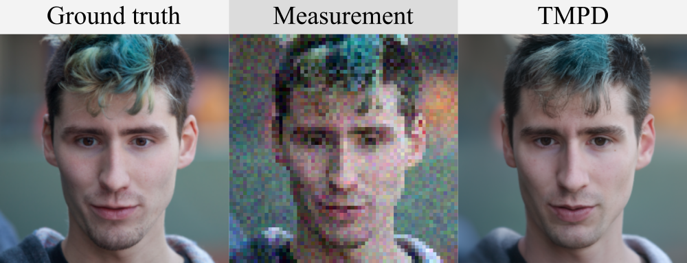

torch port of [Tweedie Moment Projected Diffusions for Inverse Problems](https://arxiv.org/pdf/2310.06721.pdf)
========================================================
This is a pytorch port of the [JAX implementation](https://github.com/bb515/tmpdjax) (the JAX implementation is faster and more comprehensive). This repo contains the Torch implementation for the paper [Tweedie Moment Projected Diffusions for Inverse Problems](https://openreview.net/pdf?id=4unJi0qrTE). An example of an application to a particular inverse problem, noisy super-resolution on FFHQ is below. The animation is of the expected value of a particular sample of an image over the time steps of our algorithm.




Thank you to [nPlan](https://www.nplan.io/), who are supporting this project.

Contents:
- [Installation](#installation)
- [Examples](#examples)
- [References](#references)

## Installation
The package requires Python 3.8+. First, it is recommended to [create a new python virtual environment](https://conda.io/projects/conda/en/latest/user-guide/tasks/manage-environments.html#creating-an-environment-with-commands). 
tmpdtorch depends on
- pytorch 1.11.0
- CUDA 11.3.1
- nvidia-docker (if you use GPU in docker container)
It is okay to use lower version of CUDA with proper pytorch version, e.g., CUDA 10.2 with pytorch 1.7.0. Then,
- Clone the repository `git clone https://github.com/bb515/tmpdtorch`
- Install using `pip install -e .` from the root directory of the repository (see the `setup.py` for the requirements that this command installs).
- Download the pretrained checkpoint for FFHQ and/or ImageNet from the [link](https://drive.google.com/drive/folders/1jElnRoFv7b31fG0v6pTSQkelbSX3xGZh?usp=sharing), download the checkpoint "ffhq_10m.pt" and paste it to ./models/
```
mkdir models
mv {DOWNLOAD_DIR}/ffqh_10m.pt ./models/
```
{DOWNLOAD_DIR} is the directory that you downloaded checkpoint to.

Set environment

### [Option 1] Local environment setting

We use the external codes for motion-blurring and non-linear deblurring.

```
git clone https://github.com/VinAIResearch/blur-kernel-space-exploring bkse

git clone https://github.com/LeviBorodenko/motionblur motionblur
```

Install dependencies

```
conda create -n DPS python=3.8

conda activate DPS

pip install -r requirements.txt

pip install torch==1.12.1+cu113 torchvision==0.13.1+cu113 torchaudio==0.12.1 functorch==0.2.1 --extra-index-url https://download.pytorch.org/whl/cu113
```

<br />

### [Option 2] Build Docker image

Install docker engine, GPU driver and proper cuda before running the following commands.

Dockerfile already contains command to clone external codes. You don't have to clone them again.

--gpus=all is required to use local GPU device (Docker >= 19.03)

```
docker build -t dps-docker:latest .

docker run -it --rm --gpus=all dps-docker
```

<br />

## Examples

### Noisy inpainting, super resolution and deblur

```
python3 sample_condition.py \
--config \
--model_config=configs/model_config.yaml \
--diffusion_config=configs/diffusion_config.yaml \
--task_config={TASK-CONFIG};
```
e.g., 

```
python3 sample_condition.py --config ./configs/ve/ffhq_256_ncsnpp_continuous.py --model_config=configs/model_config.yaml --diffusion_config=configs/diffusion_config.yaml --task_config=configs/super_resolution_config.yaml
```

on the command line from the root directory of the repository.
* `config` is the path to the config file. The default config files are provided in `configs/`. They are formatted according to [`ml_collections`](https://github.com/google/ml_collections).
* `model_config` :speaker: For imagenet, use configs/imagenet_model_config.yaml
* `diffusion_config`
* `task_config`

#### Possible task configurations

```
# Linear inverse problems
- configs/super_resolution_config.yaml
- configs/gaussian_deblur_config.yaml
- configs/motion_deblur_config.yaml
- configs/inpainting_config.yaml

# Non-linear inverse problems
- configs/nonlinear_deblur_config.yaml
- configs/phase_retrieval_config.yaml
```

#### Structure of task configurations
You need to write your data directory at data.root. Default is ./data/samples which contains three sample images from FFHQ validation set.

```
conditioning:
    method: # check candidates in guided_diffusion/condition_methods.py
    params:
        scale: 0.5

data:
    name: ffhq
    root: ./data/samples/

measurement:
    operator:
        name: # check candidates in guided_diffusion/measurements.py

noise:
    name:   # gaussian or poisson
    sigma:  # if you use name: gaussian, set this.
    (rate:) # if you use name: poisson, set this.
```

## References
This repository is a fork of [diffusion posterior sampling](https://github.com/DPS2022/diffusion-posterior-sampling/tree/main). 
